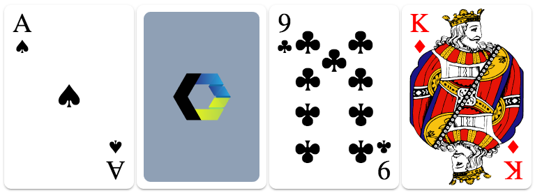

# \<game-card\>

[](https://www.webcomponents.org/element/vpusher/game-card)

🃏 Playing game card custom element based on **ES6** and **Polymer 2.0**.

This aims to act as a project sample taking advantage of native [Shadow DOM v1](https://developers.google.com/web/fundamentals/primers/shadowdom/)
and [Custom Elements v1](https://developers.google.com/web/fundamentals/primers/customelements/) APIs.

Features:

* Flippable with 3D CSS.
* Infinitely scalable thanks to unicode characters and SVG.

Example:
<!---
```
<custom-element-demo>
  <template>
    <script src="../webcomponentsjs/webcomponents-lite.js"></script>
    <link rel="import" href="game-card.html">
    <next-code-block></next-code-block>
  </template>
</custom-element-demo>
```
-->
```html
<game-card symbol="♠" rank="a" flippable></game-card>
<game-card symbol="♥" rank="3" flippable></game-card>
<game-card symbol="♦" rank="k" flippable unrevealed></game-card>
```

Screenshot:



## Installation

First, make sure you have [Bower](https://bower.io/) and the [Polymer CLI](https://www.npmjs.com/package/polymer-cli) installed.

Then,

```
bower install
polymer serve -o
```

## Usage

Add a `<game-card>` element to your page and set the `symbol` and `rank` attributes:

```
<game-card symbol="♠" rank="a"></game-card>
```

> This will show a game card front face revealed.

See documentation to know more about `symbol` and `rank` attributes.

## Contributing

1. Fork it!
2. Create your feature branch: `git checkout -b my-new-feature`
3. Commit your changes: `git commit -am 'Add some feature'`
4. Push to the branch: `git push origin my-new-feature`
5. Submit a pull request :D

## History

* **1.0.5:** IE11 support.
* **1.0.4:** introducing flippable property.
* **1.0.3:** allowing hot property updates.
* **1.0.2:** allowing uppercase rank.
* **1.0.1:** enhanced image path resolution.
* **1.0.0:** initial release.

## License

MIT license
